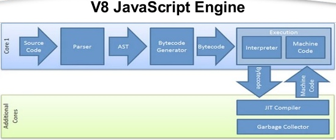

# Node.js - Aula 01 - Exercício
**user:** [ajoao88](https://github.com/ajoao88)
**autor:** João Paulo S de Araújo
**date:** 2016-02-07T09:40:00

##1. Explique como um processo síncrono e assíncrono roda no Node.js, dê um exemplo para cada.

De forma geral um processamento síncrono é uma fila única de processos, ou seja, um novo processo só começa quando o atual termina.
Já no processamento assíncrono não existe essa fila única, após responder a requisição de um processo o mesmo se inicia e o próximo já é atendido e iniciada execução, trazendo ganhos enormes de desempenho e eficiência. Para que seja gerenciado o termino dos processos, que não vai ocorrer na mesma ordem que foram iniciados, cada processo possui um callback que ao terminar o dispara, seu término é tratado como se deve e é dada continuidade ao processos.

Abaixo exemplos de uma execução síncrona e uma assíncrona de leitura de arquivos.

**Síncrona:**

```js
var fs = require('fs');
var conteudo = fs.readFileSync('./arq.txt', "utf8");
console.log(conteudo);
console.log('Leitura do primeiro arquivo terminou');
console.log('Ler próximo arquivo');
```

Retorno da execução:
> "1. Primeira linha do primeiro arquivo"
> "2. Segunda linha do primeiro arquivo"
> "3. Terceira linha do primeiro arquivo"
> "4. Quarta linha do primeiro arquivo"

> "Leitura do primeiro arquivo terminou"
> "Ler próximo arquivo"

**Assíncrona**

```js
'use strict'
var fs = require('fs');
fs.readFile('./index.txt',(err, result) => { //err e result são os callbacks de falha e sucesso, respectivamente
    if(err) console.log(err);
    console.log(result.toString());
    console.log('Leitura do primeiro arquivo terminou');
})
console.log('Ler próximo arquivo');
```
Retorno da execução:
> "Ler próximo arquivo"
> "1. Primeira linha do primeiro arquivo"
> "2. Segunda linha do primeiro arquivo"
> "3. Terceira linha do primeiro arquivo"
> "4. Quarta linha do primeiro arquivo"
> "Leitura do primeiro arquivo terminou"

Como foi possível notar, na execução síncrona só foi iniciada a leitura do próximo arquivo após acabar a leitura do primeiro, já na assícrona a leitura do próximo arquivo foi iniciada antes mesmo da leitura de cada linha do primeiro.

##2. Como o V8 executa JavaScript? Demonstre 1 exemplo com código ou imagem.

- Quando V8 recebe o código em JavaScript, ele o analisa para criar árvore de sintaxe abstrata (AST - Abstract Syntax Tree), uma espécie de preparação para o gerador de byte code.
- Em seguida, a AST é alimentado no gerador de byte code para produzir byte code.
- O ambiente de execução V8 então interpreta esse byte code e com a ajuda de um compilador JIT (Just-In-Time) produz o código de máquina nativo que é executado.

Na imagem abaixo confira o fluxograma desse funcionamento:  


##3. Qual a diferença entre um sistema single para um multi-thread?

Um sistema `single-thread` executa tarefas em uma única thread. Dessa forma, é necessário esperar o termino de uma tarefa para executar outra.
Um sistema `multi-thread` possui várias threads para execução de tarefas, podendo realiza-las simultaneamente.

##4. Como a Thread Pool tem um tamanho padrão de 4, o que acontece se você enviar 5 requisições ao banco?

A quinta requisição fica aguardando uma das quatro primeiras terminar para entrar na `Thread Pool`.

##5. Como você venderia o peixe do Node.js na sua empresa para tentar convencer seu chefe da sua adoção?

- Necessita de bem menos investimento em hardware por ser muito mais eficiente que seus concorrentes.
- Possui Inúmeras biblicotecas open-source e mais sendo criada a cada dia, eliminando custos com software.
- O NodeJS é em linguagem JavaScript que é um linguagem muito bem difundida e conhecida pela comunidade.
- É uma plataforma extremamente eficiente, possui bibliotecas assíncronas, que com investimento em hardware muito baixo em relação a concorrentes pode atender a milhões de requisioções


##6. Qual a versão do seu `node`?

> $ node -v
> v5.0.0


##7. Qual a versão do seu `npm`?

> $ npm -v
> 3.3.6
