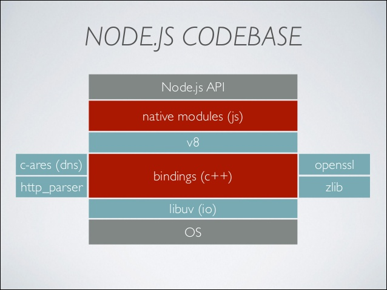

# Node.js - Aula 01 - Exercício
autor: Angelo Rogério Rubin

## Explique como um processo síncrono e assíncrono roda no Node.js, dê um exemplo para cada.

Por exemplo, se você quiser ler um arquivo no node você pode fazê-lo de forma assíncrona:

var fs = require('fs');
fs.readFile('/path', function(err, buf) {
  console.log(buf.toString());
});

O node continuará a executar qualquer código javascript que encontre durante a leitura do arquivo. Uma vez que todo o javascript foi executado e o arquivo foi lido, ele executará a função anônima e imprimirá o conteúdo do arquivo.

Você pode fazer a mesma tarefa de forma síncrona:

var fs = require('fs');
var contents = fs.readFileSync('/path').toString();
console.log(contents);

No código acima o conteúdo será definido para a variável contents e nenhum código javascript será executado enquanto o arquivo está sendo lido.

A primeira abordagem é feita de forma assíncrona e voltará imediatamente para não bloquear o código executado. 

A segunda é feita de forma síncrona e irá parar a execução do código até que a tarefa seja concluída. 

## Como o V8 executa JavaScript? Demonstre 1 exemplo com código ou imagem.

O trabalho da engine (motor) V8 do google é compilar o javascript para código nativo da maquina, para depois executá-lo.

## Qual a diferença entre um sistema single para um multi-thread?

Thread é uma forma de um processo dividir a si mesmo em duas ou mais tarefas que podem ser executadas concorrencialmente. O suporte à thread é fornecido pelo próprio sistema operacional, no caso da linha de execução ao nível do núcleo (em inglês: Kernel-Level Thread (KLT)), ou implementada através de uma biblioteca de uma determinada linguagem, no caso de uma User-Level Thread (ULT).

Uma thread permite, por exemplo, que o usuário de um programa utilize uma funcionalidade do ambiente enquanto outras linhas de execução realizam outros cálculos e operações.

O node utiliza apenas uma thread para executar suas tarefas, podendo outras serem criadas, desta forma economizando memória. Portanto ele não precisa criar um novo processo para cada novo usuário poupando CPU.

Enquanto um sistema multi-thread utiliza várias threads para executar suas tarefas e desta forma acaba consumindo muito mais seus recursos computacionais, tais como: memória, cpu, etc.

Um bom exemplo é o Apache, ele é um servidor HTTP multi-threaded, para cada pedido que o servidor recebe ele cria uma thread separada que lida com esse pedido.

## Como a Thread Pool tem um tamanho padrão de 4, o que acontece se você enviar 5 requisições ao banco?

A quinta requisição aguarda a liberação de uma thread para ser executada.

Segundo a documentação  da [libuv](http://docs.libuv.org/en/v1.x/threadpool.html) o tamanho padrão da thread pool é 4, mas pode ser alterado em tempo de inicialização, definindo a variável de ambiente UV_THREADPOOL_SIZE para qualquer valor (o máximo absoluto é de 128).

## Como você venderia o peixe do Node.js na sua empresa para tentar convencer seu chefe da sua adoção?

Citando os pontos fortes do node:

+ Permite criar aplicações de rede rápidas e escaláveis;
+ Utiliza o modelo de I/O não bloqueante e baseado em eventos;
+ As aplicações Node.js executam em uma única thread;
+ Assíncronicidade;
+ Você pode trabalhar com a mesma linguagem (javascript) no Front, Back-End e Base de Dados.

## Qual a versão do seu `node`?

PS C:\Projetos\be-mean-instagram-nodejs-exercises> node --version
v0.12.4

## Qual a versão do seu `npm`?

PS C:\Projetos\be-mean-instagram-nodejs-exercises> npm --version
2.10.1